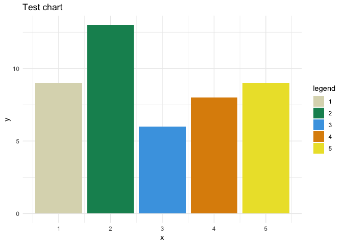

<!-- README.md is generated from README.Rmd. Please edit that file -->
quickpalette
============

[](https://travis-ci.org/EmilHvitfeldt/quickpalette)

The goal of quickpalette is to provide a few tools to quickly acquire new color palettes to be used in R.

Installation
------------

And the development version from [GitHub](https://github.com/) with:

``` r
# install.packages("devtools")
devtools::install_github("EmilHvitfeldt/quickpalette")
```

Examples
--------

### regex\_palette

Sometimes you see a color palette online and you want to use it in R, but it usually takes half a war to copy/paste in the individual hex values. The `regex_palette` function will try its best to extract a color palette from a string and return it, with the conventional leading \#. Now you just copy-paste the whole thing into a string and run the function.

Example of websites where this function could be useful includes:

-   <http://colorpalettes.net/>
-   <http://paletton.com/>
-   <https://learnui.design/tools/data-color-picker.html>
-   <http://tools.medialab.sciences-po.fr/iwanthue/>
-   <http://www.color-hex.com/color-palettes/>
-   <http://www.colourlovers.com/palettes>
-   <https://www.w3schools.com/colors/colors_palettes.asp>
-   <http://colorhunt.co/>
-   <https://coolors.co/>

``` r
library(quickpalette)
test1 <- "
   shade 0 = #AA3939 = rgb(170, 57, 57) = rgba(170, 57, 57,1) = rgb0(0.667,0.224,0.224)
shade 1 = #FFAAAA = rgb(255,170,170) = rgba(255,170,170,1) = rgb0(1,0.667,0.667)
shade 2 = #D46A6A = rgb(212,106,106) = rgba(212,106,106,1) = rgb0(0.831,0.416,0.416)
shade 3 = #801515 = rgb(128, 21, 21) = rgba(128, 21, 21,1) = rgb0(0.502,0.082,0.082)
shade 4 = #550000 = rgb( 85,  0,  0) = rgba( 85,  0,  0,1) = rgb0(0.333,0,0)" 

test2 <- "
Color   Hex RGB
          #3b5998   (59,89,152)
          #8b9dc3   (139,157,195)
          #dfe3ee   (223,227,238)
          #f7f7f7   (247,247,247)
          #ffffff   (255,255,255)
          "

test3 <- "3b59988b9dc3dfe3eef7f7f7ffffff"

test4 <- "the palatte is #3472bc, #345682 then #112233 and finally #cbac43"

regex_palette(test1)
#> [1] "#AA3939" "#FFAAAA" "#D46A6A" "#801515" "#550000"
regex_palette(test2)
#> [1] "#3b5998" "#8b9dc3" "#dfe3ee" "#f7f7f7" "#ffffff"
regex_palette(test3)
#> [1] "#3b5998" "#8b9dc3" "#dfe3ee" "#f7f7f7" "#ffffff"
regex_palette(test4)
#> [1] "#3472bc" "#345682" "#112233" "#cbac43"
```

### url\_palette

Sometimes you come across a chart with a nifty looking color palettes, but the code have been left out for one reason or another. Normally you would have 2 choices, either go hunting to for the generating code in the hopes that you will be able to find the colors used or using you favorite color meter of choice you get each color individually.

Take this chart as an example, it has 5 different colors we would like to know.



Using the `url_palette` we we can copy url of the chart and extract the main colors using clustering algorithms. `url_palette` defaults to removing all grey scale pixels as they tend to not be of interest. It used a variation of Partitioning Around Medoids (PAM) clustering to ensure that the colors actually appeared in the image.

``` r
library(magrittr)
url <- "http://serialmentor.com/dataviz/color_basics_files/figure-html4/popgrowth-US-1.png"
url_palette(url, n_clusters = 5) %>%
  pals::pal.bands()
```

Sample of palettes
------------------

And last but not least a handful of stylistic palettes.

``` r
pals::pal.bands(
  qp_art[[1]],
  qp_art[[2]],
  qp_art[[3]],
  qp_art[[4]],
  qp_art[[5]],
  labels = names(qp_art),
  main = "qp_palettes"
)
```


